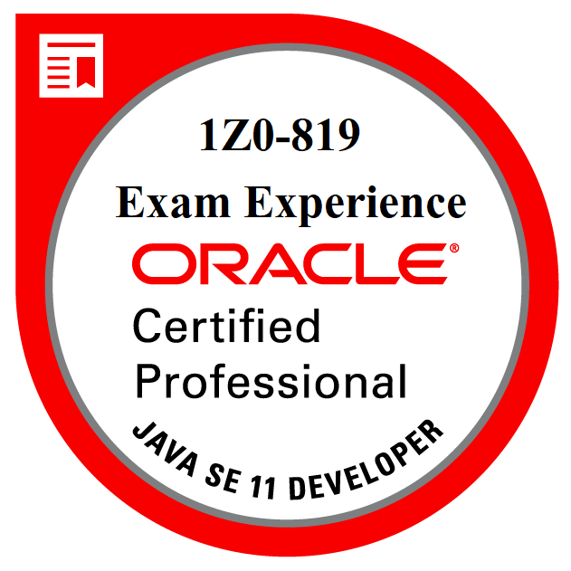

# 1Z0-819
My very own exercises as a preparation for the [Java SE 11 Developer Certification](https://education.oracle.com/product/pexam_1Z0-819)

The goal is to earn a digital badge



## Sources, tools and study material which I use
- [The Java™ Tutorials](https://docs.oracle.com/javase/tutorial)
- [Nailing 1Z0-808](http://igor.host/index.php/nailing-1z0-808)
- [Enthuware JQ+ I V11 FOR OCP-JP 11 PART 1 OCP Java 11 Programmer I](https://enthuware.com/java-certification-mock-exams/oracle-certified-associate/ocp-java-11-exam-i-1z0-815)
- [Enthuware JQ+ II V11 FOR OCP-JP 11 PART 1 OCP Java 11 Programmer II](https://enthuware.com/java-certification-mock-exams/oracle-certified-professional/ocp-java-11-exam-ii-1z0-816)
- [Enthuware JD+ V11 for Oracle Certified Professional - Java SE 11 1Z0-819](https://enthuware.com/java-certification-mock-exams/oracle-certified-professional/ocp-java-11-exam-1z0-819)
- [Pluralsight Java SE 11 Developer Certification 1Z0-819 Courses](https://app.pluralsight.com/search/?q=java%20se%2011%20developer%20certification%201z0-819&type=conference%2Cvideo-course%2Cdemo%2Cguide%2Cinteractive-course%2Cproject%2Cwebinar%2Cpath%2Cassessment&m_sort=relevance&query_id=2114da91-af23-4595-a63d-9650a4741e03&is_auto_suggested=true&source=autocomplete)

## Getting Started

These instructions will get you a copy of the project up and running on your local machine for development and testing purposes.

### Prerequisites

What things you need to install the software and how to install them

- JDK 8 or later

### Installing

You can set up the project into an IDE by importing the folder. The following command shows how to do it in IntelliJ IDEA.

```
idea 1Z0-819
```

### Notes
1. [Exam Topics](app/src/main/resources/00-exam-topics/00-exam-topics.md)
1. [Working with Java data Types](app/src/main/resources/01-working-with-java-data-types/)
1. [Controlling Program Flow](app/src/main/resources/02-controlling-program-flow/)
1. [Java Object Oriented Approach](app/src/main/resources/03-java-object-oriented-approach)
1. [Exception Handling](app/src/main/resources/04-exception-handling)
1. [Working with Arrays and Collections](app/src/main/resources/05-working-with-arrays-and-collections)
1. [Working with Lambda Expressions and Streams](app/src/main/resources/06-working-with-streams-and-lambda-expressions/06-working-with-streams-and-lambda-expressions.md)
1. [Java Platform Module System](app/src/main/resources/07-java-platform-module-system)
1. [Concurrency](app/src/main/resources/08-concurrency)
1. [Java IO API](app/src/main/resources/09-java-io-api)
1. [Secure Coding in Java SE Applications](app/src/main/resources/10-secure-coding-in-java--se-applications)
1. [Database APplications with JDBC](app/src/main/resources/11-database-applications-with-jdbc/11-database-applications-with-jdbc.md)
1. [Localization](app/src/main/resources/12-localization/12-localization.md)
1. [Annotations](app/src/main/resources/13-annotations)